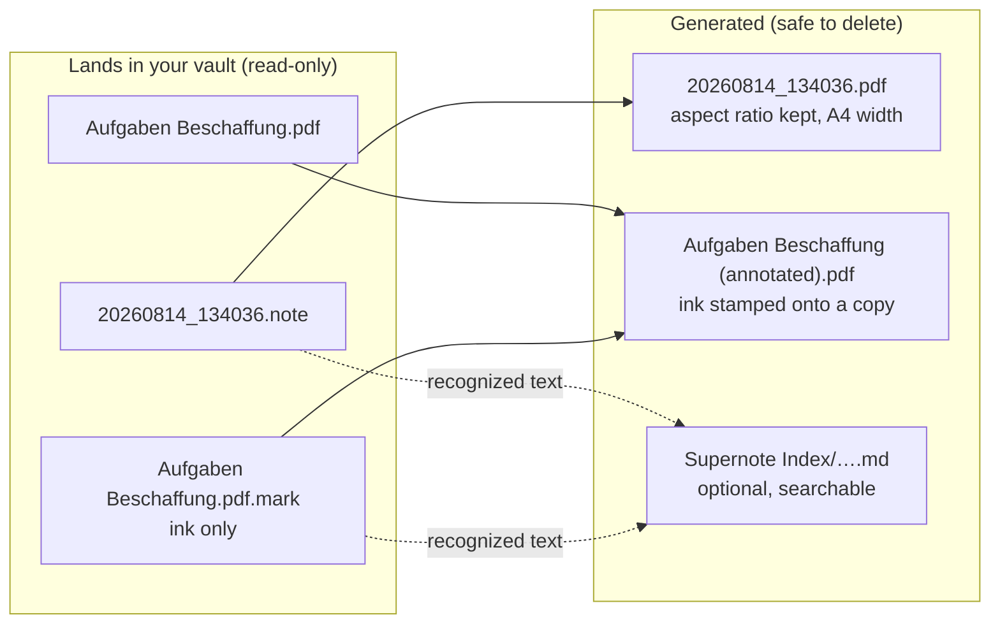
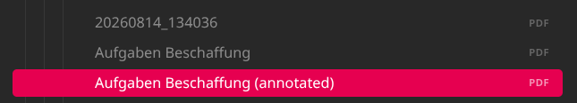

# Supernote Annotations

Read your Supernote handwriting inside Obsidian, including the annotations you draw **on top of
PDFs**, which no other Supernote plugin handles.

Sync your vault via WebDAV on Supernote, write on the device, and the plugin turns what lands there into
files Obsidian can actually open.





The same thing in a real vault: `20260814_134036.pdf` was converted from a notebook, `Aufgaben
Beschaffung.pdf` is the original you copied in, and `Aufgaben Beschaffung (annotated).pdf` is the
copy carrying your ink. The `.note` and `.mark` files sit right beside them on disk; you do not see
them because `styles.css` hides both from the file explorer.

**Why you never see the `.mark` on the device.** The Supernote stores your ink in a separate file
beside the PDF and draws the two together as you read, so its file browser shows only one item and
your strokes stay editable.

It is pure JavaScript with no native code and no external services, so it runs on the desktop app
and on a phone alike.

## It never touches your originals

This is the design premise, not a footnote:

- **`.note`, `.mark` and your original PDFs are opened read-only. Always.** The plugin has no code
  path that writes to them.
- The annotated PDF is a **separate file**, so the ink stays editable on the device.
- Everything generated is safe to delete. It gets rebuilt on the next scan.
- Nothing is sent anywhere. No network calls, no telemetry, no account.

## Install

**From the community directory:** Settings → Community plugins → Browse → search for
"Supernote Annotations" → Install → Enable.

**Manually:** download `main.js`, `manifest.json` and `styles.css` from the
[latest release](https://github.com/JUNSKIx1/obsidian-supernote-annotations/releases/latest) into
`<vault>/.obsidian/plugins/supernote-annotations/`, then enable it in Settings → Community plugins.

## Use it

Create a Note or annotate a PDF in your vault via your Supernote device. (Either sync via Supernote's own Browse & Access, a WebDAV mount, Dropbox, Nextcloud, a USB copy). The plugin watches the vault and
converts anything that appears.

New files are picked up automatically. There is also a **Scan all files** command, and a
**Scan** button in settings, for a full pass over everything.

### Annotating a PDF

Copy the PDF into your vault, open it on the Supernote, and write on it. When the `.mark` reaches
your vault, the plugin stamps it onto a copy and you get `YourFile (annotated).pdf`.

If you keep writing, the copy is regenerated. Delete it whenever you like.

### Searchable handwriting (optional, off by default)

Switch on **Write text sidecars** and the plugin saves the device's own handwriting recognition as
a small Markdown file, so Obsidian's search and tag pane can see words that otherwise live inside
an image. Any `#tag` you wrote by hand becomes a real tag.

This only works for files where you enabled handwriting recognition **on the device**. It is a
per-file setting in the Supernote's own menus, and the plugin cannot turn it on for you. Files
without recognition produce no sidecar at all, which is expected rather than a failure.

Sidecars are the only thing this plugin writes into your notes, which is why they are off until you
ask for them.

## Settings

| Setting | Default | What it does |
| --- | --- | --- |
| Convert `.note` files to PDF | on | A real PDF next to every notebook |
| Stamp `.mark` files onto a PDF copy | on | The annotated copy described above |
| Filename suffix | ` (annotated)` | Appended to the annotated copy |
| Write text sidecars | **off** | Recognized handwriting as searchable Markdown |
| Sidecar folder | `Supernote Index` | Where the twins go, mirroring the source path below it |
| Extra frontmatter | empty | Extra properties for every sidecar, one per line |

`styles.css` also hides `.note` and `.mark` files in the file explorer, since Obsidian cannot open
them anyway. The files stay on disk, untouched.

## Requirements

- **Obsidian 1.5.0 or later.**
- **Desktop and mobile both work.** No Node or Electron APIs are used.
- PDF generation needs the platform's `CompressionStream`, which means a Chromium-based desktop app
  (all current Obsidian desktop builds) or **iOS 16.4 or later**. On anything older you get a clear
  error instead of a broken PDF.
- Decoding allocates roughly 20 MB per page, so work is serialised deliberately. A long notebook
  takes a moment, and on a phone that restraint is what stops the OS killing Obsidian.

## How it works

A few things about the format were established by measurement. They look arbitrary and are not;
if you change them, re-run the tests.

**The ink overlay is fit-by-aspect and centred, not stretched.** The device displays a PDF fitted
to its 1920×2560 screen with the aspect ratio preserved, and stores strokes in *screen*
coordinates. So an A4 page occupies a centred sub-rectangle with 54 px bars, and mapping ink back
onto the page means scaling by that fitted size. Stretching the full canvas onto the page instead
misplaces every single stroke. `placement()` in `src/render.js` is the one place this is computed.

**Which PDF page a stroke belongs to comes from the container footer**, `sn.footer.PAGE`, a map
of `{ "1": offset, … }` keyed by *PDF page number*. A `.mark` stores only the pages you actually
annotated, so the nth entry is not the nth page of the document.

**An empty `.mark` is normal.** The device writes one merely from opening a PDF, so most of them
never receive a stroke. Those produce nothing at all, on purpose; otherwise every PDF you so much
as glanced at would sprout a pointless duplicate.

**The RATTA_RLE decoder is hand-written** (`src/rle.js`), which is why the plugin needs no image
library and runs on a phone. It is verified page by page against
[supernote-tool](https://github.com/jya-dev/supernote-tool) as ground truth. One known and
deliberate difference: palette greys decode to 128/169 here where `supernote-tool` renders
157/201 and adds an antialiasing fringe. That is a rendering choice on its side, not a decoding
disagreement, and the test compares palette pixels to account for it.

## How this differs from the other Supernote plugins

Three others exist in the directory, and they solve different problems:

- **Supernote (Unofficial):** viewing `.note` files in Obsidian, exporting them, and screen
  mirroring. The most featureful for notebooks.
- **Supernote Digests:** importing digest backups and turning highlights into notes.
- **Supernote Cloud Sync:** mirroring files to and from Supernote Cloud.

**None of them handles `.mark` files.** If all you want is to read your notebooks, one of the above
may suit you better. This plugin exists for the case where you read PDFs on the device (lecture
slides, papers, scripts) and want that marked-up PDF back in your vault, with the original intact
and the annotations still editable on the device.

## Development

No global tooling required beyond Node.

```bash
npm install
npm run build        # esbuild → main.js
npm run lint         # the same rules the community directory's review runs
npm test             # every suite
```

**Never hand-edit `main.js`.** It is generated, and your changes go on the next build.

The tests that need real Supernote files read them from a directory you name, since handwriting
does not belong in a public repo. Point it at anything containing `.note`/`.mark` files:

```bash
SUPERNOTE_SAMPLES=~/MyVault npm test
```

Without it, the unit tests still run and the rest skip themselves.

| Suite | Checks | Needs |
| --- | --- | --- |
| `tests/sidecar-test.mjs` | tag extraction, page collection, sidecar shape | nothing |
| `tests/bundle-test.mjs` | loads the built `main.js` exactly as Obsidian does | built `main.js` |
| `tests/pdf-test.mjs` | full pipeline into a temp dir; asserts sources are byte-identical after | samples |
| `tests/decoder-test.mjs` | every page against `supernote-tool`: canvas size exactly, bounding box within 2 px, blank-or-not exactly, pixel count within 0.5% | samples, `supernote-tool`, python3 + Pillow |

The decoder test is the one that must not regress. Run it after any change to `src/rle.js`.

## License and attribution

**GPL-3.0-or-later.** See [LICENSE](LICENSE).

This plugin uses the Supernote container parser from
[supernote-typescript](https://gitlab.com/philips/supernote-typescript) by Philip Smith, which is
GPL-3.0-or-later, hence the license of the whole. [pdf-lib](https://github.com/Hopding/pdf-lib) is
MIT. The RATTA_RLE decoder, the PNG encoder and the overlay geometry in this repository are
original work, developed against [supernote-tool](https://github.com/jya-dev/supernote-tool)
(Apache-2.0) as a reference implementation.

Not affiliated with, endorsed by, or supported by Ratta or Obsidian. "Supernote" is a trademark of
Ratta Software Technology.
