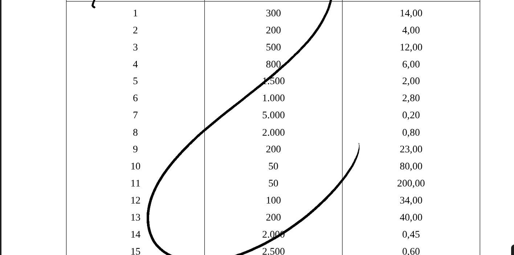

# Supernote Annotations

View your Supernote notes and annotated PDFs seamlessly as converted PDFs. Standard .note files are automatically converted and displayed as PDFs, while annotated PDFs, including their accompanying .mark annotation files, are rendered together so all handwritten notes and annotations appear directly on the PDF.

## 📑 Contents

- [🔒 It never changes what is inside your originals](#-it-never-changes-what-is-inside-your-originals)
- [📦 Install](#-install)
- [▶️ Use it](#-use-it)
- [⚙️ Settings](#-settings)
- [🔧 Requirements](#-requirements)
- [🧠 How it works](#-how-it-works)
- [🔀 How this differs from the other Supernote plugins](#-how-this-differs-from-the-other-supernote-plugins)
- [🛠️ Development](#-development)
- [💬 Support](#-support)
- [⚖️ License and attribution](#-license-and-attribution)

Sync your vault via WebDAV on Supernote, write on the device, and the plugin turns what lands there into
files Obsidian can actually open.

![How the files get to you and what happens to them. Your Supernote and your vault are kept in step, both ways, by WebDAV or any other file sync — Nextcloud, Dropbox, Supernote Cloud, or just a USB copy; the plugin syncs nothing itself, it only watches the folder. Three files land there read-only and are never modified: a .note notebook, a PDF you copied in, and its .pdf.mark ink layer. You then open three things: a new PDF converted from the notebook, that same PDF you copied in — byte-for-byte unchanged, now with your ink drawn on it as it opens — and an optional searchable Markdown index built from recognized handwriting](assets/images/pipeline.png)

**Why you never see the `.mark` on the device.** The Supernote stores your ink in a separate file
beside the PDF and draws the two together as you read, so its file browser shows only one item and
your strokes stay editable.

It is pure JavaScript with no native code and no external services, so it runs on the desktop app
and on a phone alike.

## Example


This is an example PDF. It consists of two files actually but get displayed as one PDF in you Vault. The lines drawn are the content of the .mark file and the everything else is the PDF itself. It just gets merged.

## 🔒 It never changes what is inside your originals

This is the design premise, not a footnote:

- 🔒 **`.note`, `.mark` and your original PDFs are opened read-only. Always.** The plugin has no
  code path that writes a single byte into them.
- 📁 It *will* move and rename them, but only ever to follow you — see
  [Moving files around](#-moving-files-around). It never picks a location for you.
- 📄 Your ink is **drawn as the PDF opens**, never written into it, so the strokes stay editable on
  the device and the copy it syncs back stays clean.
- 🗑️ Everything generated is safe to delete. A converted PDF comes back as a stand-in on the next
  scan and converts again the next time you open it.
- 🚫 Nothing is sent anywhere. No network calls, no telemetry, no account.

## 📦 Install

**From the community directory:** Settings → Community plugins → Browse → search for
"Supernote Annotations" → Install → Enable.

**Manually:** download `main.js`, `manifest.json` and `styles.css` from the
[latest release](https://github.com/JUNSKIx1/obsidian-supernote-annotations/releases/latest) into
`<vault>/.obsidian/plugins/supernote-annotations/`, then enable it in Settings → Community plugins.

## ▶️ Use it

Create a Note or annotate a PDF in your vault via your Supernote device. (Either sync via Supernote's own Browse & Access, a WebDAV mount, Dropbox, Nextcloud, a USB copy). The plugin watches the vault and
converts anything that appears.

New files are picked up automatically. There is also a **Scan all files** command, and a
**Scan** button in settings, for a full pass over everything.

### ⚡ Nothing is converted until you open it

Starting Obsidian does not convert anything. A scan reads your notebooks, writes the searchable
sidecars, and stops — **no page is decoded until you actually open the file**. On a vault of
twenty notebooks that is the difference between a launch that costs 42 seconds and one that costs
a tenth of a second.

Open a notebook's PDF and it converts right then, with a badge in the corner while it works. The
file you opened jumps ahead of everything else queued, so you are never waiting behind a notebook
you were not looking at. It is converted once and stays converted.

Until then the `.pdf` is a one-page **stand-in** naming the notebook and its page count. It has to
be a real file: Obsidian cannot open a `.note`, so the PDF is the thing you click, link to and
embed — deferring the conversion cannot mean deferring the file too. Your Supernote will receive
that stand-in over the same sync, which is why it says what it is rather than showing a blank page.

**Handwriting search works regardless.** Sidecars come from the text the device recognised, not
from the page images, so they are written on the first scan and searchable immediately — including
for notebooks you have never opened.

Want everything built up front anyway — before a flight, say? **Scan all files** converts the lot.

⚠️ A PDF **embedded** in a note with `![[…]]` does not count as opening it. The embed shows the
stand-in, starts the conversion in the background, and picks up the real pages the next time that
note renders.

### ✍️ Annotating a PDF

Copy the PDF into your vault, open it on the Supernote, and write on it. When the `.mark` reaches
your vault, **the PDF starts showing your ink** — the same one file, no second copy to pick
between. Keep writing and it keeps up. As above, the ink is drawn the first time you open the
file, not when the `.mark` lands.

The file on disk never changes. The ink is drawn as Obsidian opens it, from the `.mark` beside it,
which is exactly what the device does. Delete the `.mark` and the PDF is plain again, with nothing
to clean up.

That the original stays pristine is not tidiness, it is required: your vault is the folder your
Supernote syncs with. A PDF that went back to the device with the ink already baked into it would
get the live `.mark` layer drawn on top of the bake — every stroke twice, and worse on every pass.

**Upgrading from a version that made two files?** The old `YourFile (annotated).pdf` copies are
left exactly where they are — they are your files, and this plugin does not delete things it did
not just make. They are simply no longer updated. Delete them yourself whenever you like; the ink
lives in the `.mark`, so nothing is lost.

**Prefer a separate file?** Turn off **Show the annotations inside the PDF** and you get
`YourFile (annotated).pdf` beside the original, as earlier versions did.

### 📁 Moving files around

One PDF on screen is still several files on disk. `Lecture.pdf` travels with `Lecture.pdf.mark`
and its Markdown sidecar; a notebook travels with the PDF made from it. **Move or rename any one
of them and the rest follow** — drag the PDF into another folder in Obsidian and everything lands
beside it, sidecar included, into the mirrored path under the index folder.

This is not a nicety. The `.mark` finds its PDF by name alone, so renaming `Lecture.pdf` on its
own would orphan the ink permanently, with nothing to tell you.

Moves go through Obsidian's own rename, so **`[[links]]` and `![[embeds]]` pointing at any of
these files are rewritten for you**, in whatever link style you have configured.

It works in both directions: dragging a sidecar to a different folder inside the index moves the
files it indexes to match, because the index mirrors your vault's structure by definition.

Nothing is ever overwritten. If something with the same name already sits at the destination, that
companion stays where it is and you get a notice saying so.

⚠️ Moves made **outside** Obsidian — in Nextcloud, a file manager, or while Obsidian is closed —
fire no event, so the group is not kept together. Move these files from inside Obsidian.

### 🔍 Searchable handwriting (optional, off by default)

Switch on **Write text sidecars** and the plugin saves the device's own handwriting recognition as
a small Markdown file, so Obsidian's search and tag pane can see words that otherwise live inside
an image. Any `#tag` you wrote by hand becomes a real tag.

This only works for files where you enabled handwriting recognition **on the device**. It is a
per-file setting in the Supernote's own menus, and the plugin cannot turn it on for you. Files
without recognition produce no sidecar at all, which is expected rather than a failure.

Sidecars are the only thing this plugin writes into your notes, which is why they are off until you
ask for them.

## ⚙️ Settings

| Setting | Default | What it does |
| --- | --- | --- |
| Convert `.note` files to PDF | on | A real PDF next to every notebook |
| Stamp `.mark` files onto a PDF copy | on | The annotations described above |
| Show the annotations inside the PDF | on | One PDF rather than two — off gives you the separate file |
| Filename suffix | ` (annotated)` | Appended to the separate copy, when you use one |
| Write text sidecars | **off** | Recognized handwriting as searchable Markdown |
| Sidecar folder | `Supernote Index` | Where the twins go, mirroring the source path below it |
| Extra frontmatter | empty | Extra properties for every sidecar, one per line |

`styles.css` also hides `.note` and `.mark` files in the file explorer, since Obsidian cannot open
them anyway. The files stay on disk, untouched.

## 🔧 Requirements

- **Obsidian 1.5.0 or later.**
- **Desktop and mobile both work.** No Node or Electron APIs are used.
- PDF generation needs the platform's `CompressionStream`, which means a Chromium-based desktop app
  (all current Obsidian desktop builds) or **iOS 16.4 or later**. On anything older you get a clear
  error instead of a broken PDF.
- Decoding allocates roughly 20 MB per page, so work is serialised deliberately. A long notebook
  takes a moment, and on a phone that restraint is what stops the OS killing Obsidian.

## 🧠 How it works

A few things about the format were established by measurement. They look arbitrary and are not;
if you change them, re-run the tests.

**The ink overlay is fit-by-aspect and centred, not stretched.** The device displays a PDF fitted
to its 1920×2560 screen with the aspect ratio preserved, and stores strokes in *screen*
coordinates. So an A4 page occupies a centred sub-rectangle with 54 px bars, and mapping ink back
onto the page means scaling by that fitted size. Stretching the full canvas onto the page instead
misplaces every single stroke. `placement()` in `src/render.js` is the one place this is computed.

**Which PDF page a stroke belongs to comes from the container footer**, `sn.footer.PAGE`, a map
of `{ "1": offset, … }` keyed by *PDF page number*. A `.mark` stores only the pages you actually
annotated, so the nth entry is not the nth page of the document.

**An empty `.mark` is normal.** The device writes one merely from opening a PDF, so most of them
never receive a stroke. Those produce nothing at all, on purpose; otherwise every PDF you so much
as glanced at would sprout a pointless duplicate.

**The one PDF is one file because the stamped copy is not in the vault.** Obsidian's PDF view
hands PDF.js a URL rather than bytes, and the markdown embed goes through the same viewer, so
`Vault.getResourcePath` is the single place to redirect. The stamped bytes live under
`.obsidian/plugins/supernote-annotations/annotated/`, named by a hash of the `.mark`'s contents
plus the original's size — content-keyed, so a move or a rename leaves the cache valid with no
index to maintain. It is a cache: deleting the folder costs a rebuild and nothing else. On an
Obsidian that does not expose what this needs, the plugin says so and falls back to the separate
file rather than to an empty viewer.

**Decoding is deferred because it is the only expensive thing here.** Parsing a notebook,
recovering its recognised text and hashing its ink layer cost milliseconds; turning pages into
images costs seconds and roughly 20 MB per page. So a scan does everything except that, and the
decode waits for a file to be opened. The stand-in PDF a notebook gets in the meantime marks
itself with `supernote-placeholder` in its Subject, written uncompressed so recognising one is a
substring scan gated on file size rather than a parse — a marker kept inside the file cannot drift
out of step with it the way a list kept alongside would.

**The RATTA_RLE decoder is hand-written** (`src/rle.js`), which is why the plugin needs no image
library and runs on a phone. It is verified page by page against
[supernote-tool](https://github.com/jya-dev/supernote-tool) as ground truth. One known and
deliberate difference: palette greys decode to 128/169 here where `supernote-tool` renders
157/201 and adds an antialiasing fringe. That is a rendering choice on its side, not a decoding
disagreement, and the test compares palette pixels to account for it.

## 🔀 How this differs from the other Supernote plugins

Three others exist in the directory, and they solve different problems:

- **Supernote (Unofficial):** viewing `.note` files in Obsidian, exporting them, and screen
  mirroring. The most featureful for notebooks.
- **Supernote Digests:** importing digest backups and turning highlights into notes.
- **Supernote Cloud Sync:** mirroring files to and from Supernote Cloud.

**None of them handles `.mark` files.** If all you want is to read your notebooks, one of the above
may suit you better. This plugin exists for the case where you read PDFs on the device (lecture
slides, papers, scripts) and want that marked-up PDF back in your vault, with the original intact
and the annotations still editable on the device.

## 🛠️ Development

No global tooling required beyond Node.

```bash
npm install
npm run build        # esbuild → main.js
npm run lint         # the same rules the community directory's review runs
npm test             # every suite
```

❗ **Never hand-edit `main.js`.** It is generated, and your changes go on the next build.

The pipeline diagram is the same deal: edit `assets/images/pipeline.svg`, never the PNG beside it.

```bash
cd assets/images
magick -density 96 -background white pipeline.svg -colors 128 -strip PNG8:pipeline.png
```

The tests that need real Supernote files read them from a directory you name, since handwriting
does not belong in a public repo. Point it at anything containing `.note`/`.mark` files:

```bash
SUPERNOTE_SAMPLES=~/MyVault npm test
```

Without it, the unit tests still run and the rest skip themselves.

| Suite | Checks | Needs |
| --- | --- | --- |
| `tests/sidecar-test.mjs` | tag extraction, page collection, sidecar shape | nothing |
| `tests/paths-test.mjs` | which files form a group, recovered from any one of them | nothing |
| `tests/overlay-test.mjs` | the cache key: content-derived, stable across moves | nothing |
| `tests/placeholder-test.mjs` | a stand-in is never confused with a real conversion, either way | nothing |
| `tests/queue-test.mjs` | a scan never decodes; the file you opened jumps the queue; work stays serialised | built `main.js` |
| `tests/move-test.mjs` | one drag moves the group, the echo does not recurse, nothing is overwritten | built `main.js` |
| `tests/bundle-test.mjs` | loads the built `main.js` exactly as Obsidian does | built `main.js` |
| `tests/pdf-test.mjs` | full pipeline into a temp dir; asserts sources are byte-identical after | samples |
| `tests/decoder-test.mjs` | every page against `supernote-tool`: canvas size exactly, bounding box within 2 px, blank-or-not exactly, pixel count within 0.5% | samples, `supernote-tool`, python3 + Pillow |

The decoder test is the one that must not regress. Run it after any change to `src/rle.js`.

## 💬 Support

Bug reports and questions go to
**[GitHub Issues](https://github.com/JUNSKIx1/obsidian-supernote-annotations/issues)** — please
search the existing ones first, since someone may have hit it already.

A report that includes these is one I can usually act on straight away:

- Your **Obsidian version** and **platform** (Windows, macOS, Linux, iOS, Android).
- Whether it involves a **`.note`** or a **`.pdf` + `.pdf.mark`** pair.
- Anything in the **developer console** (desktop: `Ctrl`/`Cmd` + `Shift` + `I` → Console). Errors
  from this plugin are prefixed `[supernote-annotations]`.
- What you expected versus what happened.

**Please don't attach the file itself** unless you're certain it contains nothing private — a
`.note` is your handwriting. `supernote-tool analyze yourfile.note` prints the headers alone, which
is usually enough to diagnose a parsing problem.

Two things that look like bugs but aren't:

- ⚠️ **A PDF with a `.mark` beside it shows no ink.** The device writes a `.mark` merely from opening
  a PDF, so most contain no strokes at all. That is deliberate, not a failure.
- ⚠️ **A `.note` produced no sidecar.** Sidecars need handwriting recognition switched on **for that
  file, on the device**. The plugin cannot enable it for you.

This is a spare-time project. I read everything, but I can't promise a response time.

## ⚖️ License and attribution

**GPL-3.0-or-later.** See [LICENSE](LICENSE).

This plugin uses the Supernote container parser from
[supernote-typescript](https://gitlab.com/philips/supernote-typescript) by Philip Smith, which is
GPL-3.0-or-later, hence the license of the whole. [pdf-lib](https://github.com/Hopding/pdf-lib) is
MIT. The RATTA_RLE decoder, the PNG encoder and the overlay geometry in this repository are
original work, developed against [supernote-tool](https://github.com/jya-dev/supernote-tool)
(Apache-2.0) as a reference implementation.

Not affiliated with, endorsed by, or supported by Ratta or Obsidian. "Supernote" is a trademark of
Ratta Software Technology.
